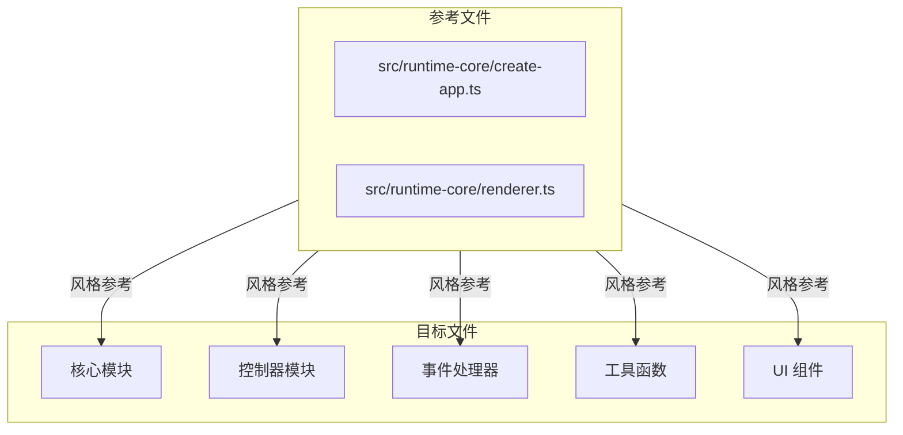

# Design Document: LIS Visualization Annotation

## Overview

本设计为 `playground/views/lis-visualization/` 目录下的源码文件添加中文代码注释。采用分批处理策略，按模块逐步添加注释，确保注释风格与仓库现有注释保持一致。

## Architecture



## Components and Interfaces

### 目标文件清单

#### 核心模块
- `types.ts` - 核心类型定义（接口、类型别名）
- `trace.ts` - LIS 追踪函数实现
- `navigator.ts` - 步骤导航器
- `index.tsx` - 主页面组件

#### 控制器模块 (`controllers/`)
- `index.ts` - 控制器导出
- `state-manager.ts` - 状态管理器
- `playback-controller.ts` - 播放控制器
- `keyboard-handler.ts` - 键盘处理器
- `hover-manager.ts` - Hover 管理器

#### 事件处理器 (`handlers/`)
- `index.ts` - 事件处理器导出
- `event-handlers.ts` - 事件处理器工厂

#### 工具函数 (`utils/`)
- `index.ts` - 工具函数导出
- `chain-utils.ts` - 链构建工具
- `highlight-utils.ts` - 高亮计算工具
- `input-utils.ts` - 输入处理工具

#### UI 组件 (`components/`)
- `index.ts` - 组件导出
- `array-display.tsx` - 数组显示组件
- `action-panel.tsx` - 操作面板组件
- `input-editor.tsx` - 输入编辑器组件
- `step-controls.tsx` - 步骤控制组件
- `sequence-graph.tsx` - 序列状态图组件

#### 序列图子组件 (`components/sequence-graph/`)
- `index.ts` - 子组件导出
- `chain-view.tsx` - 链视图组件
- `highlighted-array.tsx` - 高亮数组渲染
- `predecessor-section.tsx` - 前驱区域组件
- `sequence-section.tsx` - 序列区域组件

## Data Models

### 注释类型

| 注释类型 | 格式 | 适用场景 |
|---------|------|---------|
| JSDoc 多行注释 | `/** ... */` | 导出函数、接口、类型、大型逻辑块 |
| 块注释 | `/* ... */` | 函数内部逻辑分支、循环 |
| 行注释 | `// ...` | 简单的单行说明 |

### 注释位置规则

```
✅ 正确：前置注释
/** 函数职责说明 */
function doSomething() {
  /* 逻辑块说明 */
  if (condition) {
    // ...
  }
}

❌ 错误：行尾注释
function doSomething() { // 不要这样
  const x = 1 // 也不要这样
}
```

## 代码组织

### 注释添加策略

1. **先读取参考文件**：确认 `src/runtime-core/create-app.ts` 和 `src/runtime-core/renderer.ts` 的注释风格
2. **按模块分批处理**：核心模块 → 控制器 → 事件处理器 → 工具函数 → UI 组件
3. **保持代码结构**：不改变业务逻辑、函数签名或执行路径

### 注释内容要求

- **函数注释**：描述职责，不描述实现细节
- **接口注释**：解释接口职责和每个字段的含义
- **逻辑块注释**：解释意图，避免重复代码表面语义
- **粒度控制**：复杂逻辑 2-3 行，简单逻辑 1 句

### 注释清理和更新策略

1. **清理无效注释**：
   - 删除引用已删除代码的孤立注释
   - 删除描述不存在功能的注释
   - 删除引用不存在变量、函数或类型的注释

2. **更新过期注释**：
   - 修正与实际代码行为不符的注释
   - 更新引用已重命名标识符的注释
   - 更新描述过时算法或方法的注释
   - 验证每个注释准确描述其关联代码

## Correctness Properties

_A property is a characteristic or behavior that should hold true across all valid executions of a system—essentially, a formal statement about what the system should do. Properties serve as the bridge between human-readable specifications and machine-verifiable correctness guarantees._

### Property 1: 无行尾注释

_For any_ 目标文件，所有注释都应该位于代码行之上（前置注释），不应该出现在代码行末尾。

**Validates: Requirements 1.1, 1.2**

### Property 2: 声明注释覆盖率

_For any_ 目标文件中的函数声明、接口声明和接口属性，都应该有前置注释。

**Validates: Requirements 3.1, 4.1, 4.2, 4.3**

### Property 3: 无堆叠块注释

_For any_ 目标文件，同一段代码上方不应该有连续的多个块注释（应合并为单个注释）。

**Validates: Requirements 6.4**

### Property 4: 代码结构保持

_For any_ 目标文件，注释添加后的代码 AST 结构（去除注释后）应该与原始文件完全一致。

**Validates: Requirements 7.1, 7.3**

### Property 5: 格式检查通过

_For any_ 目标文件，注释添加后应该通过仓库的格式检查（`pnpm run fmt`）。

**Validates: Requirements 7.4**

### Property 6: 文件范围限制

_For any_ 修改操作，只有 `playground/views/lis-visualization/` 目录下的文件应该被修改。

**Validates: Requirements 8.1, 8.2**

### Property 7: 无孤立注释

_For any_ 目标文件，不应该存在引用已删除代码或不存在标识符的孤立注释。

**Validates: Requirements 9.1, 9.2, 9.3**

### Property 8: 注释准确性

_For any_ 目标文件中的注释，其描述应该与关联代码的实际行为一致。

**Validates: Requirements 10.1, 10.2, 10.3, 10.4**

## Error Handling

| 错误场景 | 处理方式 |
|---------|---------|
| 文件不存在 | 跳过该文件，继续处理其他文件 |
| 格式检查失败 | 运行 `pnpm run fmt` 修复格式问题 |
| 注释导致语法错误 | 回滚该文件的修改，检查注释语法 |

## Testing Strategy

### 测试框架

- 格式检查：`pnpm run fmt`
- 类型检查：`pnpm run typecheck`
- 现有测试：`pnpm run test`

### 验证步骤

1. **格式验证**：运行 `pnpm run fmt` 确保格式正确
2. **类型验证**：运行 `pnpm run typecheck` 确保类型正确
3. **功能验证**：运行 `pnpm run test` 确保现有测试通过
4. **手动审查**：检查注释内容是否准确、风格是否一致

### 属性测试说明

由于注释任务主要涉及代码风格和文档质量，大部分验证需要人工审查。自动化验证主要集中在：
- 格式检查通过
- 类型检查通过
- 现有测试通过
- 文件范围限制

