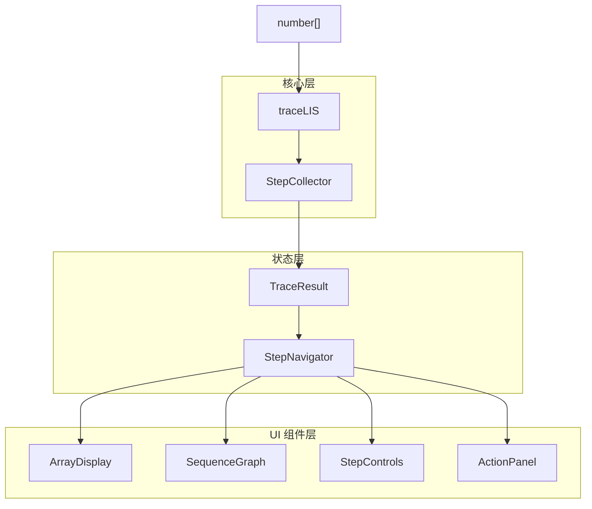
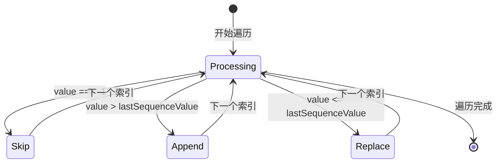
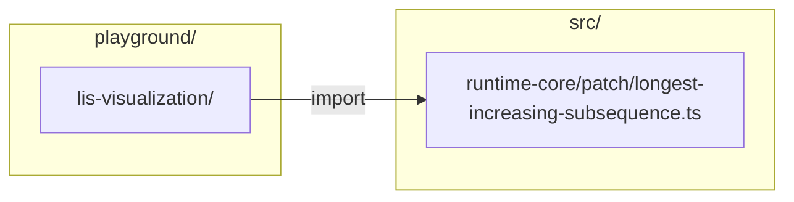

# Design Document: LIS Algorithm Visualization

## Overview

本设计为 LIS（最长递增子序列）算法提供交互式可视化功能。采用分层架构，将追踪逻辑、状态管理和 UI 组件分离。设计参考了 React Internals Explorer 的交互理念，允许用户在浏览器中逐步探索算法执行过程。

## Architecture



## Components and Interfaces

### 1. 核心数据类型

```typescript
/** 步骤操作类型 */
type StepAction =
  | { type: 'append'; index: number }
  | { type: 'replace'; position: number; index: number }
  | { type: 'skip'; index: number }

/** 单个可视化步骤 */
interface VisualizationStep {
  /** 步骤编号（从 0 开始） */
  stepIndex: number
  /** 当前处理的数组索引 */
  currentIndex: number
  /** 当前索引对应的值 */
  currentValue: number
  /** 执行的操作 */
  action: StepAction
  /** 操作后的序列状态（索引列表） */
  sequence: number[]
  /** 操作后的前驱数组 */
  predecessors: number[]
}

/** 完整追踪结果 */
interface TraceResult {
  /** 原始输入数组 */
  input: number[]
  /** 所有步骤 */
  steps: VisualizationStep[]
  /** 最终 LIS 索引列表 */
  result: number[]
}
```

### 2. 追踪函数

```typescript
/**
 * 追踪 LIS 算法执行过程，返回完整的可视化数据。
 *
 * @param indexes - 输入数组（新偏移 -> 旧索引映射）
 * @returns 包含所有步骤和最终结果的追踪数据
 */
function traceLIS(indexes: number[]): TraceResult
```

### 3. 步骤导航器

```typescript
/** 导航状态 */
interface NavigatorState {
  /** 当前步骤索引 */
  currentStep: number
  /** 总步骤数 */
  totalSteps: number
  /** 是否可以后退 */
  canGoBack: boolean
  /** 是否可以前进 */
  canGoForward: boolean
}

/** 步骤导航器 */
interface StepNavigator {
  /** 获取当前导航状态 */
  getState(): NavigatorState
  /** 获取当前步骤数据 */
  getCurrentStep(): VisualizationStep | null
  /** 前进到下一步 */
  next(): VisualizationStep | null
  /** 后退到上一步 */
  prev(): VisualizationStep | null
  /** 跳转到指定步骤 */
  goTo(stepIndex: number): VisualizationStep | null
  /** 重置到初始状态 */
  reset(): void
}

/**
 * 创建步骤导航器
 *
 * @param trace - 追踪结果
 * @returns 导航器实例
 */
function createStepNavigator(trace: TraceResult): StepNavigator
```

## Data Models

### 步骤状态机



### DOM 可视化布局（参考，实际以实现为准）

以 Step 2（处理 index=2, value=3）为例：

```
┌──────────────────────────────────────────────────────────────┐
│  LIS Algorithm Visualization                                  │
├──────────────────────────────────────────────────────────────┤
│                                                               │
│  Input Array:                                                 │
│  ┌───┐ ┌───┐ ┌───┐ ┌───┐ ┌───┐                              │
│  │ 2 │ │ 1 │ │ 3 │ │ 0 │ │ 4 │                              │
│  └───┘ └───┘ └─▲─┘ └───┘ └───┘                              │
│    0     1     2     3     4                                  │
│                │ current                                      │
│                                                               │
│  Sequence State: [1, 2] → values: [1, 3]                     │
│                                                               │
│  Predecessors: [-1, -1, 1, -1, -1]                           │
│                                                               │
│  ┌─────────────────────────────────────────────────────────┐ │
│  │  Chain View (当前时刻)                                   │ │
│  │                                                          │ │
│  │  Chain 1 (length: 2):                                   │ │
│  │    ┌───┐      ┌───┐                                     │ │
│  │    │ 1 │ ←─── │ 3 │                                     │ │
│  │    └───┘      └───┘                                     │ │
│  │    idx:1      idx:2                                     │ │
│  │    pred:-1    pred:1                                    │ │
│  │                                                          │ │
│  └─────────────────────────────────────────────────────────┘ │
│                                                               │
│  Action: APPEND index 2 (value 3) to sequence                │
│                                                               │
├──────────────────────────────────────────────────────────────┤
│  [◀ Prev]    Step 3 / 5    [Next ▶]    [⟲ Reset]    [▶ Auto] │
└──────────────────────────────────────────────────────────────┘
```

以 Step 3（处理 index=3, value=0，替换 sequence[0]）为例：

```
┌──────────────────────────────────────────────────────────────┐
│  Input Array:                                                 │
│  ┌───┐ ┌───┐ ┌───┐ ┌───┐ ┌───┐                              │
│  │ 2 │ │ 1 │ │ 3 │ │ 0 │ │ 4 │                              │
│  └───┘ └───┘ └───┘ └─▲─┘ └───┘                              │
│    0     1     2     3     4                                  │
│                      │ current                                │
│                                                               │
│  Sequence State: [3, 2] → values: [0, 3]                     │
│                                                               │
│  Predecessors: [-1, -1, 1, -1, -1]                           │
│                                                               │
│  ┌─────────────────────────────────────────────────────────┐ │
│  │  Chain View (当前时刻)                                   │ │
│  │                                                          │ │
│  │  Chain 1 (length: 1):                                   │ │
│  │    ┌───┐                                                │ │
│  │    │ 0 │                                                │ │
│  │    └───┘                                                │ │
│  │    idx:3                                                │ │
│  │    pred:-1                                              │ │
│  │                                                          │ │
│  │  Chain 2 (length: 2):                                   │ │
│  │    ┌───┐      ┌───┐                                     │ │
│  │    │ 1 │ ←─── │ 3 │                                     │ │
│  │    └───┘      └───┘                                     │ │
│  │    idx:1      idx:2                                     │ │
│  │    pred:-1    pred:1                                    │ │
│  │                                                          │ │
│  └─────────────────────────────────────────────────────────┘ │
│                                                               │
│  Action: REPLACE sequence[0] with index 3 (value 0)          │
│                                                               │
└──────────────────────────────────────────────────────────────┘
```

## 代码组织

### 设计原则

- **独立于 src/**：可视化模块作为独立工具，不污染核心库代码
- **依赖 src/**：可以导入 `@/runtime-core` 中的 LIS 算法
- **DOM 优先**：专注于交互式浏览器体验

### 文件结构

```
playground/
├── views/
│   └── lis-visualization/           # LIS 可视化独立模块
│       ├── index.tsx                # 页面入口组件
│       ├── types.ts                 # 类型定义
│       ├── trace.ts                 # 追踪函数实现
│       ├── navigator.ts             # 步骤导航器
│       ├── components/
│       │   ├── array-display.tsx    # 数组显示组件
│       │   ├── sequence-graph.tsx   # 序列状态图组件
│       │   ├── step-controls.tsx    # 导航控制组件
│       │   └── action-panel.tsx     # 操作说明面板
│       └── styles/
│           └── visualization.module.css  # 样式
├── router/
│   └── routes.ts                    # 添加 /lis-visualization 路由
```

### 依赖关系



### 路由配置

```typescript
// playground/router/routes.ts
export const routes = [
  // ... 现有路由
  {
    path: '/lis-visualization',
    component: () => import('../views/lis-visualization/index.tsx'),
  },
]
```

## 界面展示

### DOM 交互式界面（主要）

在 Playground 中提供完整的交互式可视化体验，显示以下信息：

1. **Input Array** - 输入数组，高亮当前处理的索引
2. **Sequence State** - 当前 sequence 数组（索引列表）及对应的值
3. **Predecessors** - 前驱数组
4. **Chain View** - 当前时刻的所有链表（从 sequence 中的每个索引回溯 predecessors 构建）
5. **Action** - 当前步骤执行的操作（append/replace/skip）
6. **Navigation** - 步骤导航控制

### 组件结构

```tsx
// playground/views/lis-visualization/index.tsx
export function LISVisualization() {
  return (
    <div class="lis-viz">
      <header>
        <h1>LIS Algorithm Visualization</h1>
        <InputEditor /> {/* 输入数组编辑器 */}
      </header>

      <main>
        <ArrayDisplay /> {/* 输入数组可视化 */}
        <SequenceGraph /> {/* 序列状态图 */}
        <ActionPanel /> {/* 当前操作说明 */}
      </main>

      <footer>
        <StepControls /> {/* 导航控制 */}
        <SpeedSlider /> {/* 播放速度 */}
      </footer>
    </div>
  )
}
```

## 交互方式

### DOM 交互（主要）

```typescript
// 使用示例
import { ref, computed } from '@/reactivity'
import { computeLongestIncreasingSubsequence } from '@/runtime-core'
import { traceLIS, createStepNavigator } from './trace'

// 响应式状态
const input = ref([2, 1, 3, 0, 4])
const trace = computed(() => traceLIS(input.value))
const navigator = computed(() => createStepNavigator(trace.value))
const currentStep = computed(() => navigator.value.getCurrentStep())
```

### 用户交互

| 交互方式             | 功能                   |
| -------------------- | ---------------------- |
| 点击 "Prev" / "Next" | 逐步浏览               |
| 点击 "Reset"         | 重置到初始状态         |
| 点击 "Auto"          | 自动播放 / 暂停        |
| 拖动速度滑块         | 调整播放速度           |
| 编辑输入框           | 修改输入数组，重新计算 |
| 点击数组元素         | 跳转到该元素的处理步骤 |

### 键盘快捷键

| 快捷键         | 功能                |
| -------------- | ------------------- |
| `←` / `→`      | 上一步 / 下一步     |
| `Home` / `End` | 跳转到开始 / 结束   |
| `Space`        | 播放 / 暂停自动播放 |
| `+` / `-`      | 加速 / 减速         |

## Error Handling

| 错误场景           | 处理方式                             |
| ------------------ | ------------------------------------ |
| 空数组输入         | 返回空步骤列表和空结果               |
| 无效步骤索引       | `goTo()` 返回 `null`，不改变当前状态 |
| DOM 容器不存在     | 抛出 `Error` 并提供清晰的错误信息    |
| 渲染器已销毁后调用 | 静默忽略或抛出警告                   |

## Correctness Properties

_A property is a characteristic or behavior that should hold true across all valid executions of a system—essentially, a formal statement about what the system should do. Properties serve as the bridge between human-readable specifications and machine-verifiable correctness guarantees._

### Property 1: 追踪结果与原始算法一致

_For any_ 输入数组，`traceLongestIncreasingSubsequence(input).result` 应该与 `computeLongestIncreasingSubsequence(input)` 返回完全相同的结果。

**Validates: Requirements 3.2, 7.3**

### Property 2: 步骤数量等于输入长度

_For any_ 非空输入数组，追踪结果的步骤数量应该等于输入数组的长度。

**Validates: Requirements 1.1**

### Property 3: 操作类型正确性

_For any_ 追踪步骤：

- 当 `currentValue === -1` 时，action.type 应该是 "skip"
- 当值被追加到序列末尾时，action.type 应该是 "append"
- 当值替换序列中的位置时，action.type 应该是 "replace"

**Validates: Requirements 1.2, 1.3, 1.4**

### Property 4: 步骤数据完整性

_For any_ 追踪步骤，应该包含有效的 `sequence` 数组和 `predecessors` 数组，且长度与输入一致。

**Validates: Requirements 1.5, 1.6**

### Property 5: 深拷贝隔离

_For any_ 追踪结果，修改一个步骤的 `sequence` 或 `predecessors` 数组不应影响其他步骤的数据。

**Validates: Requirements 2.1, 2.2**

### Property 6: 步骤索引和值一致性

_For any_ 追踪步骤，`currentIndex` 应该等于 `stepIndex`，且 `currentValue` 应该等于 `input[currentIndex]`。

**Validates: Requirements 2.3, 2.4**

### Property 7: 追踪结果可序列化

_For any_ 追踪结果，`JSON.parse(JSON.stringify(trace))` 应该产生与原始结果等价的对象。

**Validates: Requirements 3.4**

### Property 8: 导航操作正确性

_For any_ 步骤导航器和有效的步骤索引 n：

- `next()` 应该将 currentStep 增加 1（如果不在末尾）
- `prev()` 应该将 currentStep 减少 1（如果不在开头）
- `goTo(n)` 应该将 currentStep 设置为 n
- `reset()` 应该将 currentStep 设置为 0

**Validates: Requirements 4.1, 4.2, 4.3, 4.4**

### Property 9: 边界状态指示

_For any_ 步骤导航器：

- 当 currentStep === 0 时，canGoBack 应该为 false
- 当 currentStep === totalSteps - 1 时，canGoForward 应该为 false
- 其他情况下，canGoBack 和 canGoForward 应该为 true

**Validates: Requirements 4.5, 4.6, 4.7**

## Testing Strategy

### 测试框架

- 单元测试和属性测试：Vitest
- 属性测试库：fast-check
- 组件测试：Vitest Browser Mode (Playwright)

### 测试分类

#### 属性测试（Property-Based Tests）

每个正确性属性对应一个属性测试，使用 fast-check 生成随机输入：

```typescript
import { fc } from '@fast-check/vitest'

// 生成有效的 LIS 输入数组（包含 -1 哨兵值）
const lisInputArbitrary = fc.array(fc.oneof(fc.integer({ min: 0, max: 100 }), fc.constant(-1)), {
  minLength: 0,
  maxLength: 50,
})
```

配置：每个属性测试运行至少 100 次迭代。

#### 单元测试

- 边界情况：空数组、单元素数组、全 -1 数组
- 特定场景：已排序数组、逆序数组、重复元素
- 错误处理：无效输入、越界访问

#### 组件测试（Browser Mode）

- 数组显示组件的渲染和高亮
- 序列图组件的连接线绘制
- 导航控制的交互响应
- 键盘快捷键功能

### 测试文件结构

```
test/
├── runtime-core/patch/
│   └── longest-increasing-subsequence.test.ts  # 现有测试
playground/views/lis-visualization/
├── __tests__/
│   ├── trace.test.ts              # 追踪函数测试
│   ├── navigator.test.ts          # 导航器测试
│   ├── trace.property.test.ts     # 属性测试
│   └── components.test.tsx        # 组件测试（browser mode）
```

### 属性测试标注格式

```typescript
/**
 * Feature: lis-visualization, Property 1: 追踪结果与原始算法一致
 * Validates: Requirements 3.2, 7.3
 */
it.prop([lisInputArbitrary])('trace result matches original algorithm', (input) => {
  // ...
})
```
