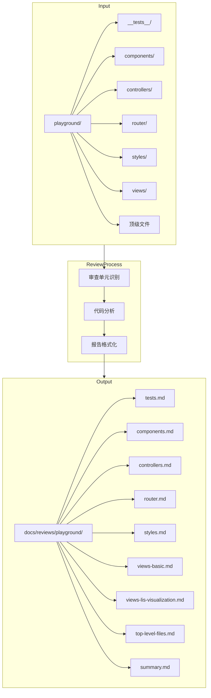

# Design Document: Playground Code Review

## Overview

本设计文档描述了 playground 代码审查系统的架构和实现方案。该系统将 playground 目录按功能模块划分为多个审查单元，对每个单元执行代码审查并生成结构化的 Markdown 报告，最终汇总所有发现。

审查系统采用人工执行 + 报告生成的模式，由开发者或 AI 助手逐个审查单元进行代码分析，系统负责管理审查状态和生成标准化报告。

## Architecture



## Components and Interfaces

### 审查单元定义

| 单元名称                | 目录/文件                             | 描述                             |
| ----------------------- | ------------------------------------- | -------------------------------- |
| tests                   | `playground/__tests__/`               | 测试文件，包含单元测试和属性测试 |
| components              | `playground/components/`              | 可复用 UI 组件                   |
| controllers             | `playground/controllers/`             | 状态管理控制器                   |
| router                  | `playground/router/`                  | 路由配置                         |
| styles                  | `playground/styles/`                  | CSS 样式文件                     |
| views-basic             | `playground/views/basic/`             | 基础示例视图                     |
| views-lis-visualization | `playground/views/lis-visualization/` | LIS 可视化模块                   |
| top-level-files         | 顶级文件组                            | app.tsx, main.ts, views/\*.tsx   |

### 报告结构接口

```typescript
interface ReviewReport {
  unitName: string // 审查单元名称
  scope: string[] // 审查范围（文件列表）
  issues: Issue[] // 发现的问题列表
  status: 'pending' | 'completed' // 审查状态
}

interface Issue {
  severity: 'Critical' | 'Major' | 'Minor'
  file: string
  description: string
}

interface SummaryReport {
  units: UnitSummary[] // 各单元摘要
  totalIssues: IssueCounts // 总问题数
}

interface UnitSummary {
  name: string
  status: 'pending' | 'completed'
  issues: IssueCounts
  reportLink: string
}

interface IssueCounts {
  critical: number
  major: number
  minor: number
}
```

## Data Models

### 报告文件格式

每个审查报告采用以下 Markdown 格式：

```markdown
# {单元名称} 审查报告

## 审查状态

{待审查 | 已完成}

## 审查范围

- file1.ts
- file2.tsx
- ...

## 发现的问题

### Critical

- [Critical] file.ts: 问题描述

### Major

- [Major] file.ts: 问题描述

### Minor

- [Minor] file.ts: 问题描述

## 统计

- Critical: N
- Major: N
- Minor: N
- 总计: N
```

### 汇总报告格式

```markdown
# Playground 代码审查汇总

## 总体统计

| 严重度   | 数量  |
| -------- | ----- |
| Critical | N     |
| Major    | N     |
| Minor    | N     |
| **总计** | **N** |

## 各单元状态

| 单元  | 状态   | Critical | Major | Minor | 报告链接           |
| ----- | ------ | -------- | ----- | ----- | ------------------ |
| tests | 已完成 | 0        | 1     | 2     | [查看](./tests.md) |
| ...   | ...    | ...      | ...   | ...   | ...                |
```

## Correctness Properties

_A property is a characteristic or behavior that should hold true across all valid executions of a system—essentially, a formal statement about what the system should do. Properties serve as the bridge between human-readable specifications and machine-verifiable correctness guarantees._

基于需求分析，以下是可测试的正确性属性：

### Property 1: 非代码文件过滤

_For any_ 文件列表，系统识别的审查文件集合应不包含任何非代码文件（如 .DS_Store、.svg、.css 等静态资源）。

**Validates: Requirements 1.3**

### Property 2: 报告结构完整性

_For any_ 生成的审查报告，该报告应包含以下必需元素：审查单元名称、审查范围、问题列表、审查状态。

**Validates: Requirements 2.3**

### Property 3: 问题格式一致性

_For any_ 报告中记录的问题，其格式应符合 `- [严重度] 文件:问题描述` 的模式。

**Validates: Requirements 2.4**

### Property 4: 严重度枚举约束

_For any_ 报告中的问题，其严重度标签应仅为 Critical、Major 或 Minor 之一。

**Validates: Requirements 2.5**

### Property 5: 问题数量上限

_For any_ 审查报告，其问题数量应不超过 5 条。

**Validates: Requirements 4.6**

### Property 6: 状态枚举约束

_For any_ 审查报告，其状态应仅为 "待审查" 或 "已完成" 之一。

**Validates: Requirements 5.1**

### Property 7: 汇总报告严重度排序

_For any_ 汇总报告中的问题列表，问题应按严重程度从高到低排序（Critical > Major > Minor）。

**Validates: Requirements 3.3**

### Property 8: 汇总报告状态一致性

_For any_ 汇总报告，其显示的各单元状态应与对应单元报告中的状态一致。

**Validates: Requirements 5.3**

## Error Handling

| 场景                       | 处理方式                                   |
| -------------------------- | ------------------------------------------ |
| 审查单元目录不存在         | 跳过该单元，在汇总报告中标记为"目录不存在" |
| 审查单元为空（无代码文件） | 生成空报告，标记为"无需审查"               |
| 报告文件写入失败           | 记录错误日志，继续处理其他单元             |
| 问题数量超过 5 条          | 截断至 5 条，在报告中注明"已截断"          |

## Testing Strategy

由于本系统主要是人工执行的审查流程，自动化测试主要集中在报告格式验证：

### 单元测试

- 测试报告模板渲染是否正确
- 测试问题格式化函数
- 测试严重度排序逻辑

### 属性测试

- 使用 fast-check 生成随机问题列表，验证格式化输出符合规范
- 生成随机文件列表，验证非代码文件过滤逻辑
- 生成随机报告数据，验证汇总统计计算正确性

### 手动验证

- 执行完整审查流程，验证报告生成
- 检查报告链接是否正确
- 验证汇总报告统计数据准确性
